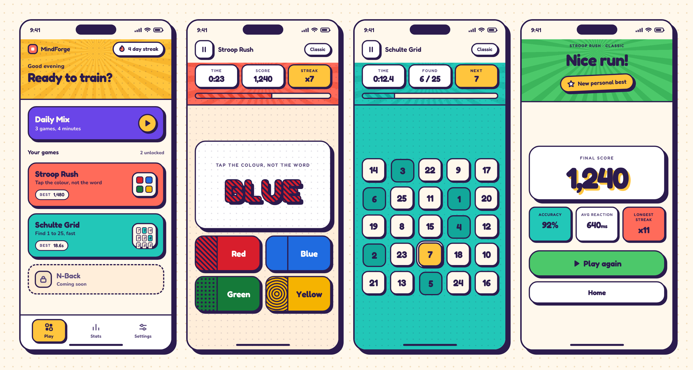
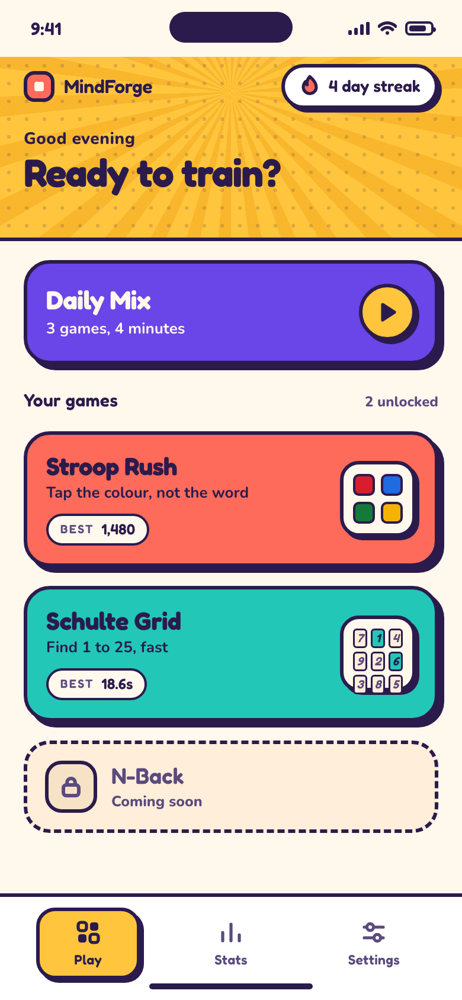
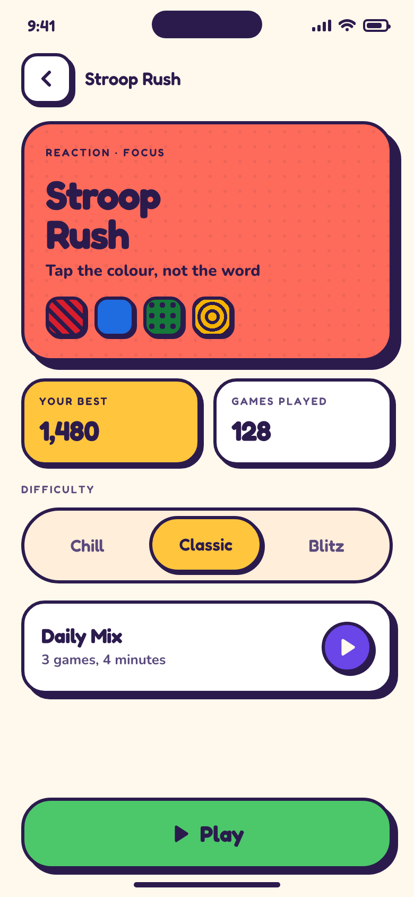
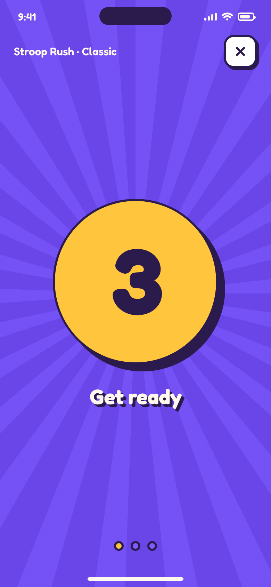
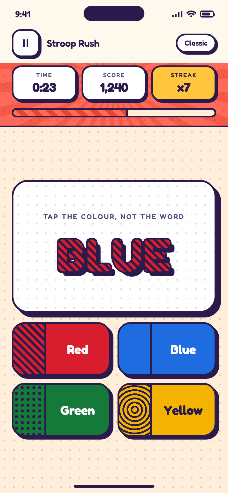
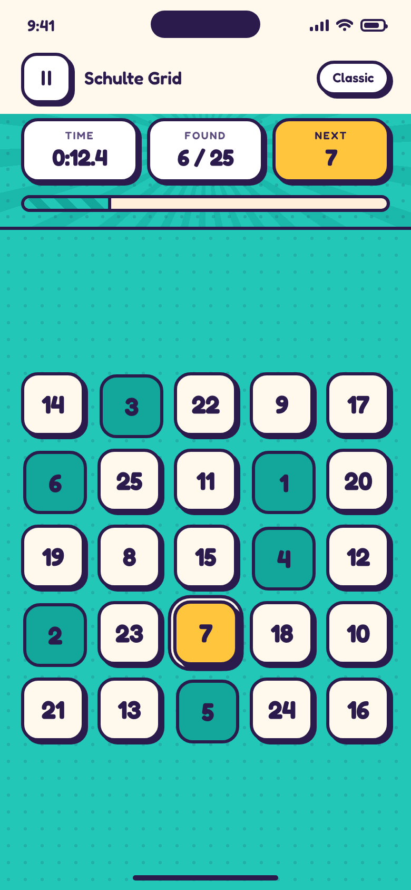
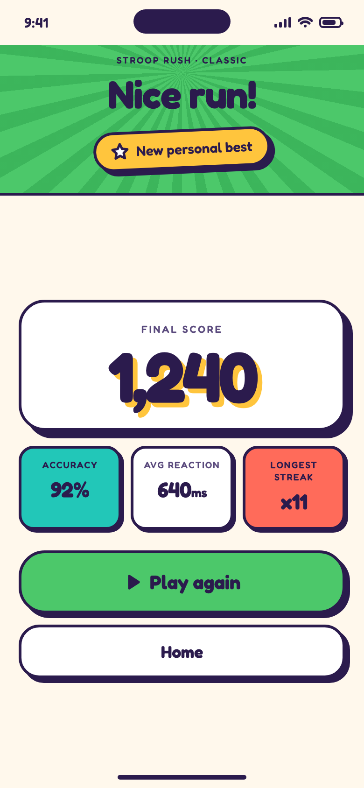
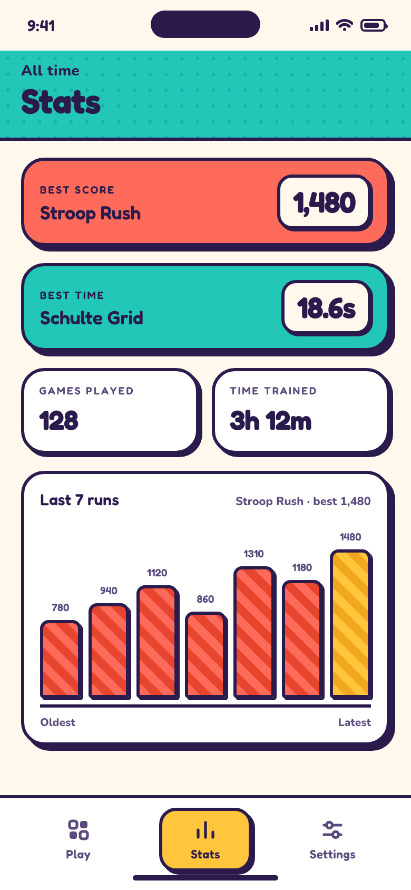
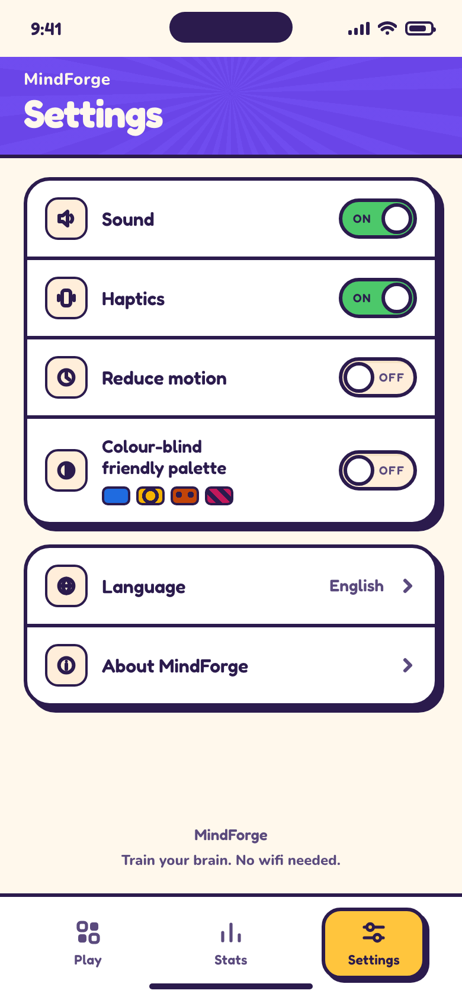

<h1 align="center">MindForge</h1>

<p align="center">
  <strong>Train your brain. No wifi needed.</strong><br>
  An offline brain-training app for iOS and Android — and an engine for building many small games from one codebase.
</p>

<p align="center">
  
  
  
  
  
</p>

<p align="center">
  
</p>

---

> **Status: in development.** The design system, the engineering conventions and the full build plan
> are done and in this repository. The Flutter app itself is not scaffolded yet — the screenshots below
> are the *design targets* every screen is built and signed off against, not shipped software.
> Progress is tracked in [`epics/README.md`](epics/README.md).

## What it is

MindForge is a small collection of brain-training games — reaction, attention and working memory —
that runs entirely on your phone.

- **Fully offline.** No network code at all. Nothing is uploaded, because there is nowhere to upload to.
- **No accounts.** No sign-up, no login, no identity. Your scores live in a database on your device.
- **No ads, no analytics, no tracking.** Zero telemetry packages.

It is also an **engine**. Everything except the game board itself — home, game detail, difficulty
select, countdown, the play scaffold, pause, results, stats, settings — is written once and shared.
Adding a game means supplying its rules, one board widget and one accent colour; it inherits every
screen for free.

The two launch games:

| Game | The task |
|---|---|
| **Stroop Rush** | The word "BLUE" is printed in red. Tap the **colour**, not the word. |
| **Schulte Grid** | Find 1 to 25 in order, as fast as you can. |

## Screens

The design direction is **Sunburst Pop** — arcade-cabinet joy. Every raised surface is a fill, a 3px
solid ink border and one hard offset shadow at zero blur, and it presses down when you touch it.

<p align="center">
  
  
  
  
</p>
<p align="center">
  
  
  
  
</p>

<p align="center"><em>
  Home · Game detail · Countdown · Stroop Rush<br>
  Schulte Grid · Results · Stats · Settings
</em></p>

Browse the full design system at [`design/sunburst-pop/system.html`](design/sunburst-pop/system.html),
all eight screens at [`design/sunburst-pop/app.html`](design/sunburst-pop/app.html), or the two
rejected alternatives from [`design/index.html`](design/index.html).

### Accessible by construction

The Stroop answer keys carry a **pattern** as well as a colour — solid, diagonal stripes, dots,
concentric rings — and the stimulus word repeats its own pattern in ink. In a game whose entire
mechanic is naming colours, colour-blind support is a correctness requirement, not a preference, so
the game is playable without any colour discrimination at all. A Settings toggle additionally swaps
the answer set to a colour-blind-safe palette, and that swap changes which colours the round is
*generated* from, not merely how they are painted.

Every text and surface pair in the palette is verified against its WCAG floor by a script that
recomputes the contrast ratios from the source values.

## Languages

MindForge ships in **four locales, two of them right-to-left**:

| Language | Code | Direction | Numerals |
|---|---|---|---|
| English | `en` | LTR | 1 2 3 |
| German | `de` | LTR | 1 2 3 |
| Persian · فارسی | `fa` | **RTL** | ۱ ۲ ۳ |
| Kurdish Sorani · کوردیی ناوەندی | `ckb` | **RTL** | ۱ ۲ ۳ |

This is not a translation layer bolted on at the end. Right-to-left reaches every component's
geometry, and Eastern Arabic numerals reach the Schulte tiles — which *are* the numbers 1 to 25.

## How this repository is built

Two things here are unusual and worth knowing about before you contribute.

**1. The conventions are executable.** `.claude/skills/` holds 45 skills — 40 general Flutter and Dart
engineering conventions, plus 5 that encode the Sunburst Pop design system specifically. They are not
style guides. Each carries worked examples and a **gate script** that fails the build on a violation:
a raw hex outside the theme directory, a blurred shadow, a game that tries to navigate, a haptic fired
outside the feedback service, a contrast ratio below its floor.

**2. The work is planned as epics before it is written.** [`epics/`](epics/README.md) holds eleven
epic files covering 123 tasks, in dependency order. Each task states its **tests before its
implementation**, the files it touches, the skills to load, and the reference screenshot it is
compared against.

```
.claude/skills/     45 skills: engineering conventions + the design system, with gate scripts
CLAUDE.md           the house rules — read this first
design/             the design exploration; sunburst-pop/ is the chosen direction
  sunburst-pop/
    system.html     authoritative for token values: hexes, radii, shadows, durations, type
    app.html        authoritative for layout and spacing across the eight screens
    screens/        the reference screenshots every implementation is compared against
epics/              the build plan, E01 to E11
```

### Building it

The app is not scaffolded yet — these commands become real with E01.

```bash
flutter pub get
dart run build_runner build --delete-conflicting-outputs
flutter gen-l10n
flutter test
flutter run -d C13DDC02-375D-4E1B-8F81-44EB407D09A4   # the canonical simulator
```

That UDID is an iPhone 14 simulator named `MindForge iPhone 14`. It is the canonical device because it
is **exactly 390×844 logical points**, matching the reference screenshots. No iPhone 16-class simulator
does — the 16 is 393×852 and the 16 Pro is 402×874 — so comparing a build against the references on
anything else is not an honest comparison.

Requires Flutter 3.44.6, Xcode 26.6 and CocoaPods.

MindForge targets **iOS and Android**. iOS is being built first, so the current epics and the
canonical device above are iOS; Android follows once the app runs end to end. Nothing in the
architecture is iOS-specific — there is no platform channel and no native UI.

Concretely, the repository holds **one platform directory, `ios/`**, and that is a decision rather
than an omission:

- **iOS ships.** It is the only target generated, built and tested today.
- **Android is deferred, not unsupported.** Re-adding it is `flutter create --platforms=android .`
  plus one PR to restore the build job. Generating an `android/` directory nobody builds, tests or
  opens costs a Gradle upgrade treadmill for zero shipped value, and `test/policy/repo_layout_test.dart`
  asserts its absence with that reason attached.
- **macOS is dropped.** It earned its place in an earlier plan only as somewhere to eyeball the app;
  the canonical simulator does that job better and more honestly, because it is exactly 390×844 while
  a macOS window is whatever the developer dragged it to.
- `web/`, `linux/` and `windows/` were never in scope.

The bundle identifier is **`io.applander.mindforge`**, registered in the Apple Developer account.
It was renamed from `com.mindforge.mindforge` on 2026-08-21 — possible only because nothing had
been uploaded yet. A bundle identifier is permanent from the first upload onward, so this one is
now fixed.

## Contributing

**Want to add a game?** That is the whole point of the engine, and there is a defined path for it:
write an epic, implement it, open a PR. Read **[CONTRIBUTING.md](CONTRIBUTING.md)** — it covers the
epic format, the TDD requirement, the screenshot comparison and what a reviewable PR looks like.

All pull requests are reviewed and merged by the maintainer.

## License

[Apache License 2.0](LICENSE). See [NOTICE](NOTICE) for attribution and third-party asset licensing.
