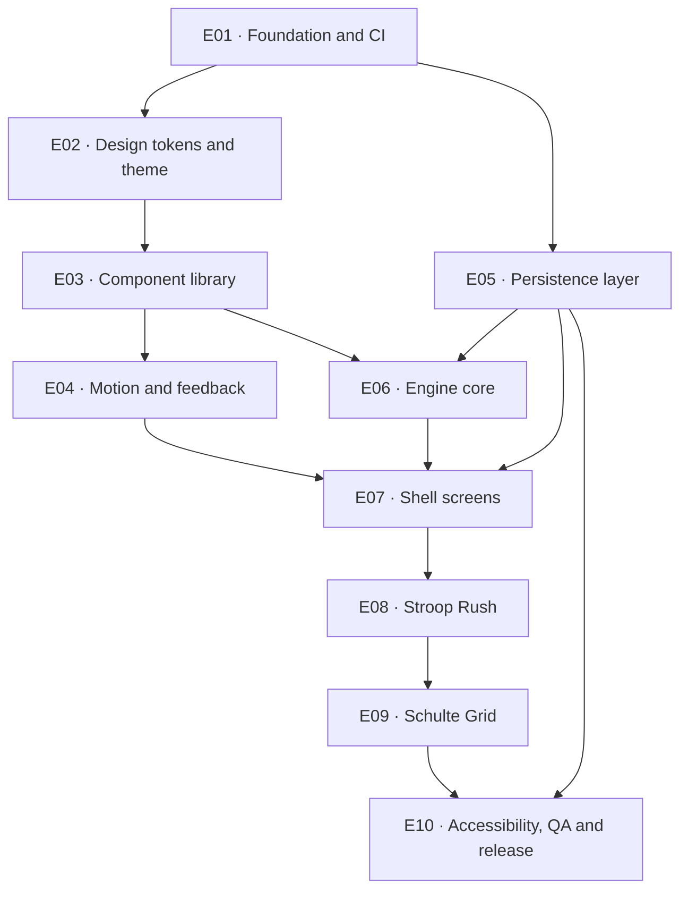

# MindForge epics

MindForge is built as ten sequential epics, E01 through E10, each one branch and one pull request. The
order is not arbitrary: it is the order in which one layer becomes buildable on top of the last. E01
turns a repository of skills and design HTML into a Flutter package with a pipeline; E02 transcribes
`design/sunburst-pop/system.html` into `lib/theme/`, because nothing above it may hold a raw aesthetic
value; E03 builds the component catalog on those tokens and E04 gives it timing and haptics; E05 opens
the database and E06 builds the engine seam over it; E07 builds all eight screens against that seam
while the games are still placeholders; E08 plugs in the first game and E09 proves the engine by
shipping the second one **without editing `lib/features/**`**; E10 runs the accessibility and QA sweep
and produces the first shippable build. Every epic is test-first, every epic ends green, and every epic
merges before the next one starts.

## Status

| Epic | Title | Branch | Depends on | Status |
|---|---|---|---|---|
| [E01](E01-foundation-and-ci.md) | Foundation and CI | `epic/01-foundation-and-ci` | nothing | Not started |
| [E02](E02-design-tokens-and-theme.md) | Design tokens and theme | `epic/02-design-tokens-and-theme` | E01 | Not started |
| [E03](E03-component-library.md) | Component library | `epic/03-component-library` | E01, E02 | Not started |
| [E04](E04-motion-and-feedback.md) | Motion and feedback | `epic/04-motion-and-feedback` | E01, E02, E03 | Not started |
| [E05](E05-persistence-layer.md) | Persistence layer | `epic/05-persistence-layer` | E01 | Not started |
| [E06](E06-engine-core.md) | Engine core | `epic/06-engine-core` | E01, E02, E03, E05 | Not started |
| [E07](E07-shell-screens.md) | Shell screens | `epic/07-shell-screens` | E01, E02, E03, E04, E05, E06 | Not started |
| [E08](E08-stroop-rush.md) | Stroop Rush | `epic/08-stroop-rush` | E01, E02, E03, E04, E05, E06, E07 | Not started |
| [E09](E09-schulte-grid.md) | Schulte Grid | `epic/09-schulte-grid` | E01, E02, E03, E04, E05, E06, E07, E08 | Not started |
| [E10](E10-accessibility-qa-and-release.md) | Accessibility, QA and release | `epic/10-accessibility-qa-and-release` | E01, E05, E07, E08, E09 | Not started |

Each epic's header table carries the same edges from both ends: if A appears in B's **Depends on**, B
appears in A's **Unblocks**. The graph below is that relation drawn out. It has no cycles, and
E01 → E10 in numeric order is a valid execution order.

## Dependency graph



The graph shows the load-bearing edges. Each epic's own **Depends on** row additionally names every
earlier epic whose symbols it consumes directly — E01 appears in all of them, because nothing compiles
without the package — and its *Current state* section lists those symbols by name so an agent picking
up the work knows what to `ls` for before writing a line.

Two edges are worth calling out because they are not obvious from the titles. **E05 does not depend on
E02, E03 or E04**: the data layer is pure Dart over drift and can be built in parallel with the design
layers if two people are working. And **E09 depends on E08**, not merely on the engine: the registry
test asserts `stroop_rush` then `schulte_grid` in that order, E09 copies E08's Riverpod provider shape
rather than inventing a second convention, and E09's final task re-compares `04-stroop-rush.png` to
prove the shared chrome did not regress.

## The delivery loop

This is the procedure for every epic, without exception.

1. **Branch off `main`.** `git checkout main && git pull && git checkout -b epic/<NN>-<slug>`. The
   branch name is in the epic's header table.
2. **Work the tasks in order, test-first.** Every task states its tests before its implementation. Write
   them, watch them fail, then make them pass. A task whose tests genuinely cannot be written first says
   why in one line — there are exactly two in the whole sequence, and both name their reason.
3. **Commit granularly.** One logical change per commit, tests committed with the code they cover. Each
   task lists the commits it should produce, in order. No emoji in commit messages (`CLAUDE.md` working
   agreement 6).
4. **Run `/simplify`, then `/code-review`,** and address the findings. Both before the PR, in that order:
   simplification first so the review reads the code you intend to ship.
5. **Get every gate green.** From the repo root:
   ```bash
   flutter pub get
   flutter gen-l10n
   dart run build_runner build --delete-conflicting-outputs   # ALWAYS before analyze
   dart format --output=none --set-exit-if-changed .
   flutter analyze --fatal-infos --fatal-warnings
   flutter test --test-randomize-ordering-seed random
   bash tool/skill_gates.sh
   ```
   `tool/skill_gates.sh` (built in E01 T01.8) is the **only** sanctioned way to run the skill gates. Do
   not write `for s in .claude/skills/*/scripts/*.sh; do bash "$s"; done` — measured against this
   repository that loop fails on 29 of the 49 scripts: five take a required argument and can never pass
   argument-less, five are runners rather than gates, and one uses `mapfile` and exits 127 on macOS
   system bash 3.2. The runner carries an explicit run table and a skip table with a reason per row, and
   `test/policy/skill_gates_coverage_test.dart` fails if a script is in neither. Each epic additionally
   lists its own **named spot-checks** — the gates whose contracts it changes — run individually so a
   failure names itself.
6. **Push and open a PR** from `.github/PULL_REQUEST_TEMPLATE.md`, whose five sections are required:
   **What changed**, **Why**, **How it was verified** (the gate commands and their output), **Screens
   compared** (the PNG filenames and the result), **Deliberately left out**.
7. **Wait for CI.** Do not merge on a pending or red pipeline.
8. **Merge preserving the granular commits.** Not a squash — the commit sequence is the record of how
   the epic was built. Then delete the branch, `git checkout main`, `git pull`.
9. **Next epic.**

**CI only exists from E01 onward.** There is no pipeline in the repository today, so E01 is the first PR
whose own workflow can be waited on: its `.github/workflows/ci.yml` is created *by* the PR that runs it.
Every later epic inherits it and step 7 is unconditional from E02 on.

## The screenshot rule

`design/sunburst-pop/screens/` holds eight PNGs — `01-home` · `02-game-detail` · `03-countdown` ·
`04-stroop-rush` · `05-schulte-grid` · `06-results` · `07-stats` · `08-settings` — rendered from
`app.html` at 390×844 @2× (so the files are 780×1688). They are the implementation targets, not
illustrations.

**Any task that builds a screen or a board runs the app at 390×844, puts the result beside the named
PNG, and compares in this order:**

1. **structure** — the same regions, in the same order, at the same relative heights
2. **spacing rhythm** — gutters, gaps, padding
3. **surface construction** — the 3px ink border, the correct hard-shadow step, `blurRadius` and
   `spreadRadius` both 0
4. **type role** — the right step from the scale, never a `copyWith(fontSize:)`
5. **sampled hex** — the actual colour values

**A difference is an implementation defect.** Fix the code. If the reference is genuinely wrong, that is
a deliberate design change and it goes the other way: edit `design/sunburst-pop/app.html`, re-run
`design/sunburst-pop/capture-screens.sh`, and commit the regenerated PNGs together with the reason. What
must never happen is silent divergence in either direction.

Three honest limits:

- **CI cannot do this.** It is a human placing two images side by side and looking at them. No workflow
  step covers it, which is why every screen task carries an explicit comparison step naming its PNG and
  its regions, and why the PR body must list which screens were compared and what was found. A screen
  merged without that line is a review reject.
- **The screenshots are end states only.** Press travel, the release, the 120ms `durTap` tween, the
  countdown beats, the wrong-answer shake and every haptic are invisible in a still. They are asserted
  by widget tests where they can be, captured as screen recordings in E10's sweep, and finally judged on
  a physical device — a simulator reproduces none of the haptics.
- **Not everything has a reference.** The pause sheet has no PNG (it is a state of the play scaffold,
  built from `system.html` §10 and the `PopSheet` component). Component-level work in E03 and E04
  compares against the rendered gallery in `system.html` §10, not against the screen PNGs, because
  `capture-screens.sh` renders `app.html`'s eight figures and produces no gallery image. Where a
  reference does not exist, the epic says so rather than inventing one.

## How to pick up work

1. **Read this file.** The graph tells you what must already be merged; the delivery loop is the
   procedure and it does not vary by epic.
2. **Read `CLAUDE.md`** at the repo root — the product constraints (offline, no accounts, no ads, no
   analytics, bundled fonts), the target `lib/` layout, the architecture decisions and the working
   agreements. Nothing in an epic may contradict it.
3. **Read the epic file end to end before writing anything.** *Current state* tells you what actually
   exists and what to `ls` for; *Risks and open questions* tells you which decisions are already made,
   which are deliberate deviations with a recorded reason, and which need a person before you proceed.
4. **Load the skills its "Skills to load" table names.** Every skill an agent needs for the tasks below
   is in that table with a concrete reason, and each task repeats the subset it needs. `flutter-conventions-index`
   is the front door for anything the table does not obviously cover.
5. **Start at the first unchecked task** and work down. Tasks are ordered by dependency, not by size.
6. **Do not shim a missing dependency.** If a symbol an epic expects is absent, that is a gap in the
   epic that owns it — fix it there. Building a second `Result`, a second press controller, a second
   PRNG or a second settings value is the failure mode these files exist to prevent, and each one is
   called out by name where it could plausibly happen.
