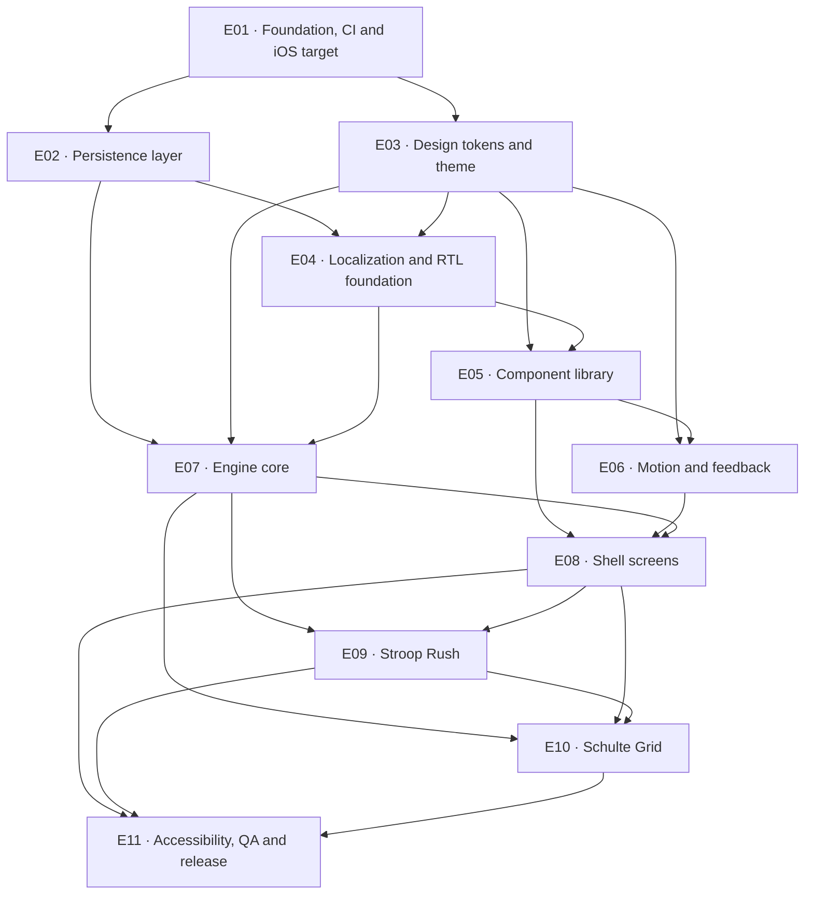

# MindForge epics

MindForge is built as eleven sequential epics, E01 through E11, each one branch and one pull request.
The order is not arbitrary: it is the order in which one layer becomes buildable on top of the last.
E01 turns a repository of skills and design HTML into a Flutter package with a pipeline and an iOS
target; E02 opens the database, because the locale override and the four feedback toggles all have to
survive a relaunch; E03 transcribes `design/sunburst-pop/system.html` into `lib/theme/` and bundles
every font the four shipped locales need, because nothing above it may hold a raw aesthetic value or a
missing glyph; **E04 turns the one-locale gen-l10n pipeline into a four-locale, two-direction
foundation and switches the RTL geometry gate on while `lib/ui/` is still empty**; E05 builds the
component catalog on those tokens, in four locales and both directions from its first commit, and E06
gives it timing and haptics; E07 builds the engine seam over the database; E08 builds all eight screens
against that seam while the games are still placeholders; E09 plugs in the first game and E10 proves
the engine by shipping the second one **without editing `lib/features/**`**; E11 runs the
accessibility and QA sweep and produces the first shippable build. Every epic is test-first, every epic
ends green, and every epic merges before the next one starts.

**MindForge ships four locales, two of them right-to-left, on iOS only.** Both facts reach every epic
below; the two sections at the end of this file state what they mean in practice, and neither is
optional background.

Two ordering decisions are worth naming, because both reverse an earlier plan and both are load-bearing:

- **Persistence moved ahead of localization.** The user's language choice must survive a relaunch (D1),
  so the settings row has to exist before the locale controller does. E02 therefore ships
  `locale_tag` in **schema v1** with a shape `CHECK`, and `enum SupportedLocale { en, de, fa, ckb }` as
  the one locale vocabulary in the repo. The consequence is worth stating plainly: **E04 ships no
  migration.** Adding three locales is a string job, not the app's first schema bump on a database that
  already holds user history.
- **Localization moved ahead of the component library.** `EdgeInsets.only(left: 16)` compiles, passes
  every test, renders correctly on a developer's LTR screen and is silently wrong in Persian. There is
  no runtime signal and no analyzer rule — the only enforcement is a grep gate over source. Turning
  that gate on costs nothing while `lib/ui/` is empty and costs a twenty-file unreviewable diff
  afterwards. E04 moves `check_i18n_bans.sh` and `check_arb_parity.sh` into `tool/skill_gates.sh`'s run
  table so directional geometry is a build failure **before E05 writes its first component**.

## Status

| Epic | Title | Branch | Depends on | Status |
|---|---|---|---|---|
| [E01](E01-foundation-ci-and-ios.md) | Foundation, CI and iOS target | `epic/01-foundation-ci-and-ios` | nothing | Not started |
| [E02](E02-persistence-layer.md) | Persistence layer | `epic/02-persistence-layer` | E01 | Not started |
| [E03](E03-design-tokens-and-theme.md) | Design tokens and theme | `epic/03-design-tokens-and-theme` | E01 | Not started |
| [E04](E04-localization-and-rtl.md) | Localization and RTL foundation | `epic/04-localization-and-rtl` | E02, E03 | Not started |
| [E05](E05-component-library.md) | Component library | `epic/05-component-library` | E03, E04 | Not started |
| [E06](E06-motion-and-feedback.md) | Motion and feedback | `epic/06-motion-and-feedback` | E03, E05 | Not started |
| [E07](E07-engine-core.md) | Engine core | `epic/07-engine-core` | E02, E03, E04 | Not started |
| [E08](E08-shell-screens.md) | Shell screens | `epic/08-shell-screens` | E05, E06, E07 | Not started |
| [E09](E09-stroop-rush.md) | Stroop Rush | `epic/09-stroop-rush` | E07, E08 | Not started |
| [E10](E10-schulte-grid.md) | Schulte Grid | `epic/10-schulte-grid` | E07, E08, E09 | Not started |
| [E11](E11-accessibility-qa-and-release.md) | Accessibility, QA and release | `epic/11-accessibility-qa-and-release` | E08, E09, E10 | Not started |

Each epic's header table carries the same edges from both ends, and **both columns name direct edges
only** — if A appears in B's **Depends on**, B appears in A's **Unblocks**, and neither column lists a
transitive ancestor. The graph below is that relation drawn out. It has no cycles, and E01 → E11 in
numeric order is a valid execution order.

`epics/superseded/` holds the ten files of the previous sequence, each with a header naming the epic
that replaced it. They are kept for the record; nothing is built from them.

## Dependency graph



Each epic's *Current state* section lists the inherited symbols by name, so an agent picking up the
work knows what to `ls` for before writing a line. Four edges are worth calling out because they are
not obvious from the titles:

- **E02 does not depend on E03 or E04.** The data layer is pure Dart over drift and can be built in
  parallel with the design layers if two people are working. It is numbered second because everything
  downstream of it needs durable settings, not because it needs anything from them.
- **E04 depends on both E02 and E03**, and on both for concrete reasons: E02 for `SupportedLocale`, the
  `locale_tag` column and `settingsProvider`; E03 for the Arabic-script faces and the script-aware type
  resolution the first Persian string will render through.
- **E06 has no direct edge to E04** but reaches it through E05, and T06.9's `DirectionalSlide` watches
  `localeProvider`. The edge is transitive, not absent; E06's *Current state* says so in one line.
- **E10 depends on E09**, not merely on the engine: the registry test asserts `stroop_rush` then
  `schulte_grid` in that order, E10 copies E09's Riverpod provider shape rather than inventing a second
  convention, and E10's final task re-compares `04-stroop-rush.png` — and its RTL counterpart — to
  prove the shared chrome did not regress.

## Localization

Four locales, decided in ADR 0002 and not re-opened by any epic:

| Locale | Code | Direction | Role |
|---|---|---|---|
| English | `en` | LTR | template ARB, source of truth for keys, and the fallback |
| German | `de` | LTR | the text-expansion stress case (~30% longer) |
| Persian | `fa` | **RTL** | Arabic script, Eastern Arabic numerals |
| Kurdish Sorani | `ckb` | **RTL** | Arabic script plus the Sorani letters ڕ ڵ ۆ ێ ھ |

Resolution: the system locale if it is one of the four, else `en`. The user can override it in
Settings and the choice persists through E02's `locale_tag` column. `lib/core/supported_locale.dart`
is the **only** list of shipped locales in the repo; `lib/l10n/supported_locales.dart` and the test
harness's `LocaleCase.all` are projections of it, never second lists.

**Numerals.** `en` and `de` render Latin digits with their own grouping separators; `fa` and `ckb`
render **Eastern Arabic numerals** `۰۱۲۳۴۵۶۷۸۹` (U+06F0–U+06F9, with U+066B decimal and U+066C group —
**never** the Arabic-Indic block U+0660–U+0669, whose 4, 5 and 6 are different glyphs). A Persian UI
full of `1480` reads as untranslated, not as a cosmetic slip. The numbering system is pinned explicitly
per locale in `LocaleNumbers`, which is the **one** `NumberFormat` construction site in `lib/`; `ckb`
is pinned to `fa`'s symbol data because `intl` 0.20.2 ships none for `ckb` and would fall back to Latin
digits silently. Everything normalises back to ASCII through `AsciiNumerals.normalize` before any parse
or comparison. This reaches further than it sounds: **the Schulte Grid tiles are the numbers**, so in
`fa`/`ckb` they render ۱–۲۵ with different advance widths, which is an input to E10's cell-sizing
arithmetic.

**Seeded generation is locale-independent, and that is a tested property.** Generators produce integers
and semantic tokens; localisation happens at render. A golden vector that moves because the locale
moved means a formatter leaked into `lib/core/` or `lib/games/`, and three policy tests exist to make
that impossible.

**Fonts, and the honest consequence.** Fredoka and Nunito have **no Arabic-script coverage**, so E03
bundles Vazirmatn for body and — only if its `cmap` and `GSUB`/`GPOS` tables measure clean for
ڕ ڵ ۆ ێ ھ ە ڤ and the Persian digit block — Lalezar for display, falling back to Vazirmatn at its
heaviest weight otherwise. Every face is bundled with its OFL text registered through
`LicenseRegistry`; `google_fonts` is banned because the app is offline. **The Fredoka personality does
not survive translation.** Fredoka's rounded, wide, arcade voice has no Arabic-script counterpart, and
whichever display face wins is a different kind of loud, not the same one. In `fa` and `ckb` the
Sunburst Pop identity is carried by the **shape language** — the 3px ink border, the hard offset shadow
at zero blur, the press-down translate, the saturated palette on cream. That is enough; those four
things were always the direction. But a font swap is not neutral and these files do not pretend it is.

**The `ckb` delegate is the sharp technical risk.** Measured on this machine:
`kMaterialSupportedLanguages` in `flutter_localizations` lists 82 codes and `ckb` is not among them, so
`GlobalMaterialLocalizations` cannot serve it and switching locale throws. Worse, the failure has a
silent half: `_WidgetsLocalizationsDelegate.isSupported` returns `true` for **every** locale and hands
back `DefaultWidgetsLocalizations`, whose direction is hardcoded LTR — so fixing only the Material half
leaves a Sorani build that runs fine and reads backwards. E04 T04.4 vendors a Material, Cupertino and
Widgets delegate trio serving our ARB strings while delegating Material/Cupertino chrome to the nearest
supported script neighbour (`fa`, else `ar`), verifies the **actual** delegate list at build time
rather than assuming it, and carries a test that re-asserts the gap so a future SDK adding `ckb` turns
the workaround red instead of letting it rot.

**Translation quality is an open question and must not be presented as closed.** The `fa` and
especially the `ckb` strings are machine-quality. Sorani is a low-resource language, and game copy is
short, idiomatic and dense with UI convention — the register machine translation is worst at.
**Decision: ship the strings, flag them loudly, and gate release on native review.** E11's design/QA
sweep carries a BLOCKER-graded line item: one native Persian and one native Sorani reader walk all
eight screens on the canonical simulator before the build is signed off. No epic between here and there
may quietly mark this done.

## iOS first

**iOS is the only shipping target. Android is deferred by decision, not by oversight.** No epic ships
an `android/` edit, a `values-*` resource directory or a claim of parity; when Android is picked up it
is its own epic. Say so rather than implying parity.

The app is built and run on the iOS Simulator, and **one specific simulator is canonical**:

```bash
xcrun simctl boot C13DDC02-375D-4E1B-8F81-44EB407D09A4
flutter run -d C13DDC02-375D-4E1B-8F81-44EB407D09A4
```

`MindForge iPhone 14`, UDID `C13DDC02-375D-4E1B-8F81-44EB407D09A4`, iOS 18.6. It exists because it is
**exactly 390×844 logical points**, which is exactly the geometry `capture-screens.sh` rendered the
reference PNGs at (780×1688 @2×). No iPhone 16-class simulator matches — iPhone 16 is 393×852 and
16 Pro is 402×874 — so a screenshot comparison run on anything else is not an honest comparison.

`ios/Runner/Info.plist` declares `CFBundleDevelopmentRegion` = `en` and `CFBundleLocalizations` =
`en, de, fa, ckb`, written by E01 T01.9 and re-asserted by a policy test in E04 T04.1. Without those
keys the iOS system locale never resolves to `fa` or `ckb` no matter what the Dart side supports, and
the failure is invisible on a device set to English.

Verified on this machine and pinned in E01 T01.1 — **do not re-derive these; do re-assert them in a
test, which is not the same thing:**

| Fact | Value |
|---|---|
| Flutter / Dart / DevTools | 3.44.6 stable · Dart 3.12.2 · DevTools 2.57.0 |
| Xcode / CocoaPods | 26.6 (build 17F113) · 1.15.2 |
| Simulator runtimes available | iOS 18.0, 18.6, 26.5 |
| `intl` | `0.20.2` — an **exact** pin inside `flutter_localizations`, not a range |

## The delivery loop

This is the procedure for every epic, without exception.

1. **Branch off `main`.** `git checkout main && git pull && git checkout -b epic/<NN>-<slug>`. The
   branch name is in the epic's header table.
2. **Work the tasks in order, test-first.** Every task states its tests before its implementation. Write
   them, watch them fail, then make them pass. A task whose tests genuinely cannot be written first says
   why in one line — there are exactly two in the whole sequence, and both name their reason.
3. **Commit granularly.** One logical change per commit, tests committed with the code they cover. Each
   task lists the commits it should produce, in order. No emoji in commit messages (`CLAUDE.md` working
   agreement 6).
4. **Run `/simplify`, then `/code-review`,** and address the findings. Both before the PR, in that order:
   simplification first so the review reads the code you intend to ship.
5. **Get every gate green.** From the repo root:
   ```bash
   flutter pub get
   flutter gen-l10n
   dart run build_runner build --delete-conflicting-outputs   # ALWAYS before analyze
   dart format --output=none --set-exit-if-changed .
   flutter analyze --fatal-infos --fatal-warnings
   flutter test --test-randomize-ordering-seed random
   flutter test --tags golden                                 # from E03 on
   bash tool/skill_gates.sh
   ```
   `tool/skill_gates.sh` (built in **E01 T01.11**) is the **only** sanctioned way to run the skill gates.
   Do not write `for s in .claude/skills/*/scripts/*.sh; do bash "$s"; done` — measured against this
   repository that loop fails on 29 of the 49 scripts: five take a required argument and can never pass
   argument-less, five are runners rather than gates, and one uses `mapfile` and exits 127 on macOS
   system bash 3.2. The runner carries an explicit run table and a skip table with a reason per row, and
   `test/policy/skill_gates_coverage_test.dart` fails if a script is in neither. Each epic additionally
   lists its own **named spot-checks** — the gates whose contracts it changes — run individually so a
   failure names itself.
6. **Push and open a PR** from `.github/PULL_REQUEST_TEMPLATE.md`, whose five sections are required:
   **What changed**, **Why**, **How it was verified** (the gate commands and their output), **Screens
   compared** (the PNG filenames, LTR and RTL, and the result), **Deliberately left out**.
7. **Wait for CI.** Do not merge on a pending or red pipeline.
8. **Merge preserving the granular commits.** Not a squash — the commit sequence is the record of how
   the epic was built. Then delete the branch, `git checkout main`, `git pull`.
9. **Next epic.**

**CI only exists from E01 onward.** There is no pipeline in the repository today, so E01 is the first PR
whose own workflow can be waited on: its `.github/workflows/ci.yml` is created *by* the PR that runs it.
Every later epic inherits it and step 7 is unconditional from E02 on.

## The screenshot rule

There are now **two** reference sets, and every screen task names which one it compares against.

- `design/sunburst-pop/screens/` holds the eight English LTR PNGs — `01-home` · `02-game-detail` ·
  `03-countdown` · `04-stroop-rush` · `05-schulte-grid` · `06-results` · `07-stats` · `08-settings` —
  rendered from `app.html` at 390×844 @2× (so the files are 780×1688).
- `design/sunburst-pop/screens/rtl/` holds their **Persian RTL counterparts**, at the same eight
  basenames and the same 780×1688. **E04 T04.11 produces them**; they do not exist before that epic
  merges, and every epic that names one says so. They are rendered from the *same* `app.html` through
  the *same* `capture-screens.sh --rtl`, reading their Persian strings straight out of
  `lib/l10n/app_fa.arb`, so the reference and the app cannot disagree.

They are implementation targets, not illustrations.

**Any task that builds a screen or a board runs the app at 390×844 on `MindForge iPhone 14`, puts the
result beside the named PNG, and compares in this order:**

1. **structure** — the same regions, in the same order, at the same relative heights
2. **spacing rhythm** — gutters, gaps, padding
3. **surface construction** — the 3px ink border, the correct hard-shadow step, `blurRadius` and
   `spreadRadius` both 0
4. **type role** — the right step from the scale, never a `copyWith(fontSize:)`
5. **sampled hex** — the actual colour values

For RTL work the ordering gains a sixth and seventh check, and one deliberate non-check:

6. **mirroring** — the streak chip, the BEST pills, the nav bar, the difficulty control, the chart axis
   and the back affordance have all moved to the opposite side
7. **numerals and glyphs** — Eastern Arabic digits everywhere a number appears, no tofu box anywhere,
   nothing sheared at the top or bottom of a score or a countdown numeral
8. **the hard offset shadow does NOT mirror** — it is a light-source constant, one imaginary light for
   the whole app, not a reading-direction property. A Persian build lit from the other side would
   disagree with every screenshot. Padding, alignment and icon direction mirror; illumination does not.
   This is the single question a reviewer will raise on the RTL PR, so it is answered in the source, in
   `test/policy/directional_geometry_test.dart`, in E04 and in the PR body.

**A difference is an implementation defect.** Fix the code. If the reference is genuinely wrong, that is
a deliberate design change and it goes the other way: edit `design/sunburst-pop/app.html`, re-run
`design/sunburst-pop/capture-screens.sh` (and `--rtl`), and commit the regenerated PNGs together with
the reason. What must never happen is silent divergence in either direction.

Four honest limits:

- **CI cannot do this.** It is a human placing two images side by side and looking at them. No workflow
  step covers it, which is why every screen task carries an explicit comparison step naming its PNG and
  its regions, and why the PR body must list which screens were compared and what was found. A screen
  merged without that line is a review reject.
- **The screenshots are end states only.** Press travel, the release, the 120ms `durTap` tween, the
  countdown beats, the wrong-answer shake and every haptic are invisible in a still. They are asserted
  by widget tests where they can be, captured as screen recordings in E11's sweep, and finally judged on
  a physical device — a simulator reproduces none of the haptics.
- **Not everything has a reference.** The pause sheet has no PNG (it is a state of the play scaffold,
  built from `system.html` §10 and the `PopSheet` component); the Language sheet has none in either
  direction. Component-level work in E05 and E06 compares against the rendered gallery in
  `system.html` §10, not against the screen PNGs, because `capture-screens.sh` renders `app.html`'s
  eight figures and produces no gallery image. Where a reference does not exist, the epic says so rather
  than inventing one.
- **Goldens are not references.** The PNGs under `test/goldens/` are test artifacts, blessed once on the
  pinned runner, and are a different thing from `design/sunburst-pop/screens/`. A golden proves a
  *change* in shaping, mirroring or digit block; it does not prove the shaping is correct and proves
  nothing whatsoever about translation.

## How to pick up work

1. **Read this file.** The graph tells you what must already be merged; the delivery loop is the
   procedure and it does not vary by epic; the Localization and iOS-first sections are context every
   epic assumes.
2. **Read `CLAUDE.md`** at the repo root — the product constraints (offline, no accounts, no ads, no
   analytics, bundled fonts, four locales), the target `lib/` layout, the architecture decisions and the
   working agreements. Nothing in an epic may contradict it.
3. **Read the epic file end to end before writing anything.** *Current state* tells you what actually
   exists and what to `ls` for; *Risks and open questions* tells you which decisions are already made,
   which are deliberate deviations with a recorded reason, and which need a person before you proceed.
4. **Load the skills its "Skills to load" table names.** Every skill an agent needs for the tasks below
   is in that table with a concrete reason, and each task repeats the subset it needs.
   `flutter-conventions-index` is the front door for anything the table does not obviously cover, and
   **`i18n-rtl-l10n` is required for any task touching strings, geometry, numerals or dates** — which,
   from E04 on, is most of them.
5. **Start at the first unchecked task** and work down. Tasks are ordered by dependency, not by size.
6. **Do not shim a missing dependency.** If a symbol an epic expects is absent, that is a gap in the
   epic that owns it — fix it there. Building a second `Result`, a second press controller, a second
   PRNG, a second number formatter, a second locale list or a second settings value is the failure mode
   these files exist to prevent, and each one is called out by name where it could plausibly happen.
